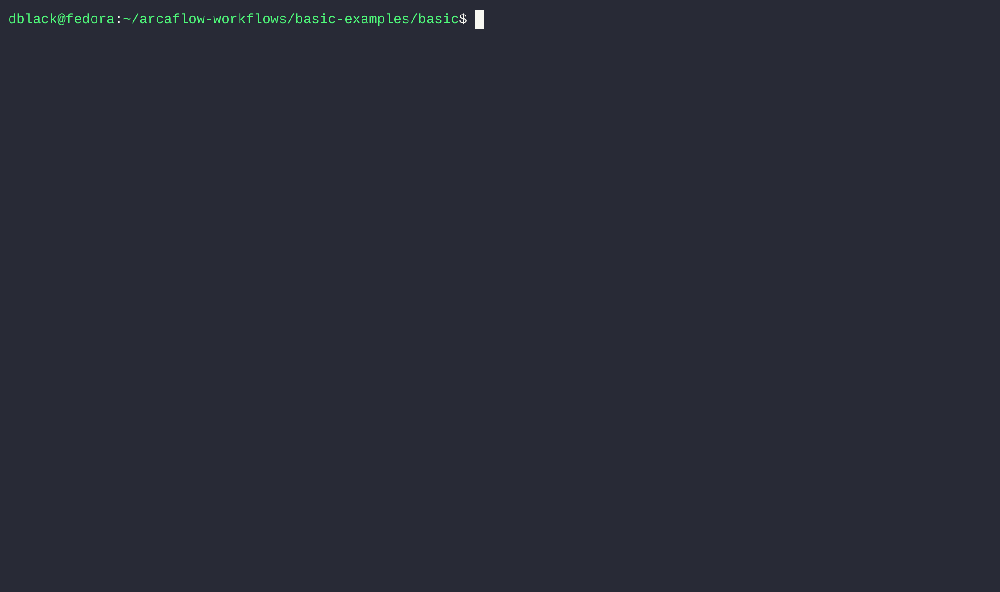

# Arcaflow: The Noble Workflow Engine


Arcaflow is a highly-flexible and portable workflow system that helps you to build
pipelines of actions via plugins. Plugin steps typically perform one action well, 
creating or manipulating data that is returned in a machine-readable format. Data is
validated according to schemas as it passes through the pipeline in order to clearly
diagnose type mismatch problems early. Arcaflow runs on your laptop, a jump host, or in
a CI system, requiring only the Arcaflow engine binary, a workflow definition in YAML,
and a compatible container runtime.

[Complete Arcaflow Documentation](https://arcalot.io/arcaflow)



# The Arcaflow Engine

The Arcaflow Engine is the core execution component for workflows. It allows you to use
actions provided by containerized plugins to build pipelines of work. The Arcaflow
engine can be configured to run plugins using Docker, Podman, and Kubernetes.

 An ever-growing catalog of
[official plugins](https://github.com/orgs/arcalot/repositories?q=arcaflow-plugin-) are
maintained within the Arcalot organization and are available as
[versioned containers from Quay.io](https://quay.io/organization/arcalot). You can also
build your own containerized plugins using the the Arcaflow SDK, available for
[Python](https://arcalot.io/arcaflow/creating-plugins/python/) and
[Golang](https://github.com/arcalot/arcaflow-plugin-sdk-go). We encourage you to
contribute your plugins to the community, and you can start by adding them to the
[plugins incubator](https://github.com/arcalot/arcaflow-plugins-incubator) repo via a
pull request.

## Pre-built engine binaries

Our pre-built engine binaries are available in the
[releases section](https://github.com/arcalot/arcaflow-engine/releases) for multiple
platforms and architectures.

## Building from source

This system requires at least Go 1.18 to run and can be built from source:

```
go build -o arcaflow cmd/arcaflow/main.go
```

This self-contained engine binary can then be used to run Arcaflow workflows.

## Running a simple workflow

A set of [example workflows](https://github.com/arcalot/arcaflow-workflows) is available
to demonstrate workflow features. A basic example `workflow.yaml` may look like this:

```yaml
version: v0.2.0  # The compatible workflow schema version
input:  # The input schema for the workflow
  root: RootObject
  objects:
    RootObject:
      id: RootObject
      properties:
        name:
          type:
            type_id: string
steps:  # The individual steps of the workflow
  example:
    plugin:
      deployment_type: image
      src: quay.io/arcalot/arcaflow-plugin-example
    input:
      name: !expr $.input.name
outputs:  # The expected output schema and data for the workflow
  success:
    message: !expr $.steps.example.outputs.success.message
```

As you can see, a workflow has the root keys of `version`, `input`, `steps`, and
`outputs`. Each of these keys is required in a workflow. Output values and inputs to
steps can be specified using the Arcaflow
[expression language](https://arcalot.io/arcaflow/workflows/expressions/). Input and
output references create dependencies between the workflow steps which determine their
execution order.

An input YAML file for this basic workflow may look like this:

```yaml
name: Arca Lot
```

The Arcaflow engine uses a configuration to define the standard behaviors for deploying
plugins within the workflow. The default configuration will use Docker as the container
runtime and will set the log outputs to the `info` level.

If you have a local Docker / Moby setup installed, you can simply run the workflow like
this:

```bash
arcaflow --input input.yaml
```

This results in the default behavior of using the built-in configuration and reading the
workflow from the `workflow.yaml` file in the current working directory.

If you don't have a local Docker setup, or if you want to use another deployer or any
custom configuration parameters, you can create a `config.yaml` with your desired
parameters. For example:

```yaml
deployers:
  image: 
    deployer_name: podman
log:
  level: debug
logged_outputs:
  error:
    level: debug
```

You can load this config by passing the `--config` flag to Arcaflow.

```bash
arcaflow --input input.yaml --config config.yaml
```

The default workflow file name is `workflow.yaml`, but you can override this with the
`--workflow` input parameter.

Arcaflow also accepts a `--context` parameter that defines the base directory for all
input files. All relative file paths are from the context directory, and absolute paths
are also supported. The default context is the current working directory (`.`).

### A few command examples...

Use the built-in configuration and run the `workflow.yaml` file from the `/my-workflow`
context directory with no input:

```bash
arcaflow --context /my-workflow
```

Use a custom `my-config.yaml` configuration file and run the `my-workflow.yaml` workflow
using the `my-input.yaml` input file from the current directory:

```bash
arcaflow --config my-config.yaml --workflow my-workflow.yaml --input my-input.yaml
```

Use a custom `config.yaml` configuration file and the default `workflow.yaml` file from
the `/my-workflow` context directory, and an `input.yaml` file from the current working
directory:

```bash
arcaflow --context /my-workflow --config config.yaml --input ${PWD}/input.yaml
```

## Deployers

Image-based deployers are used to deploy plugins to container platforms. Each deployer
has configuraiton parameters specific to its platform. These deployers are:

- [Docker](https://github.com/arcalot/arcaflow-engine-deployer-docker)
- [Podman](https://github.com/arcalot/arcaflow-engine-deployer-podman)
- [Kubernetes](https://github.com/arcalot/arcaflow-engine-deployer-kubernetes)

There is also a
[Python deployer](https://github.com/arcalot/arcaflow-engine-deployer-python) that
allows for running Python plugins directly instead of containerized. *Note that not all
Python plugins may work with the Python deployer, and any plugin dependencies must be
present on the target system.*
